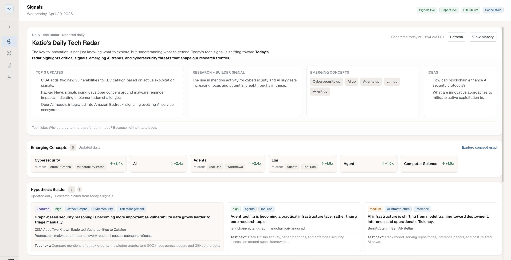
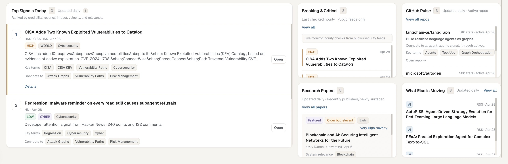
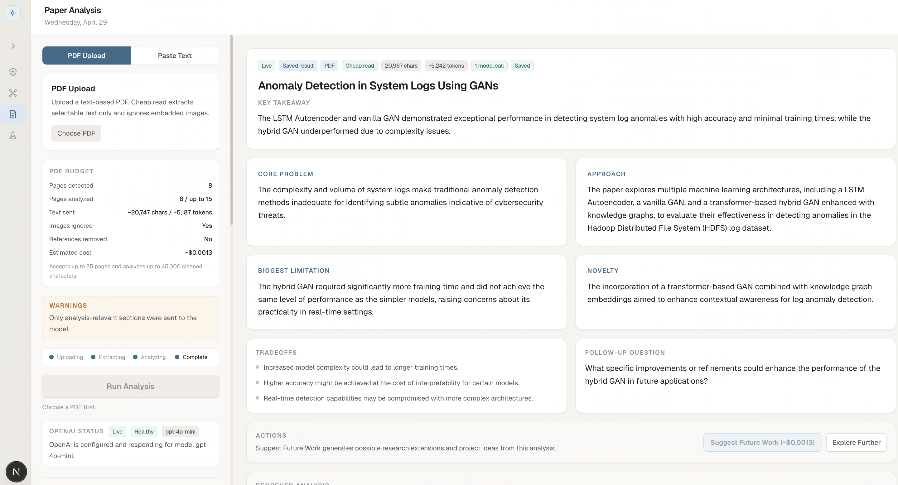
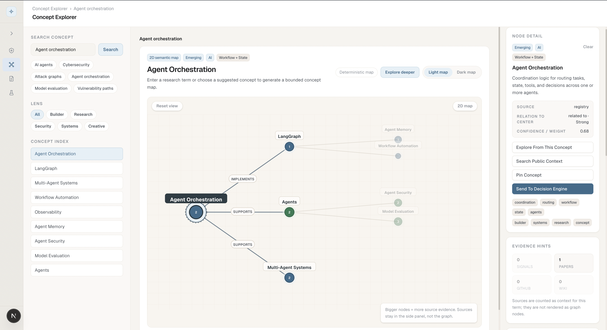
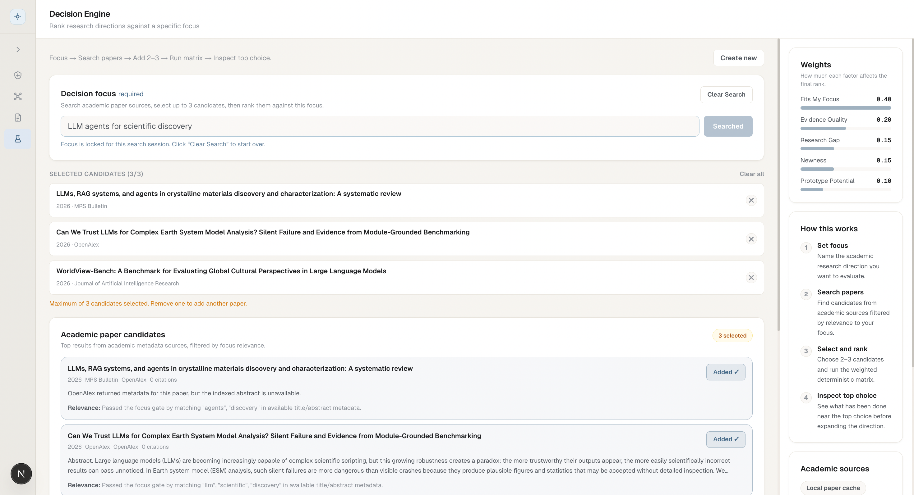
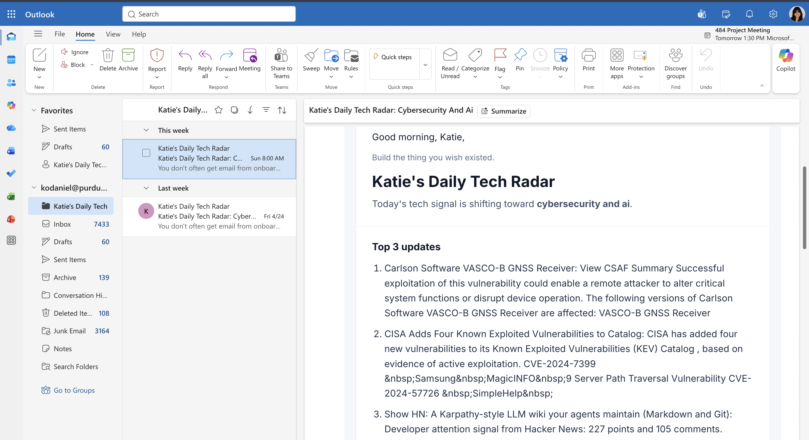
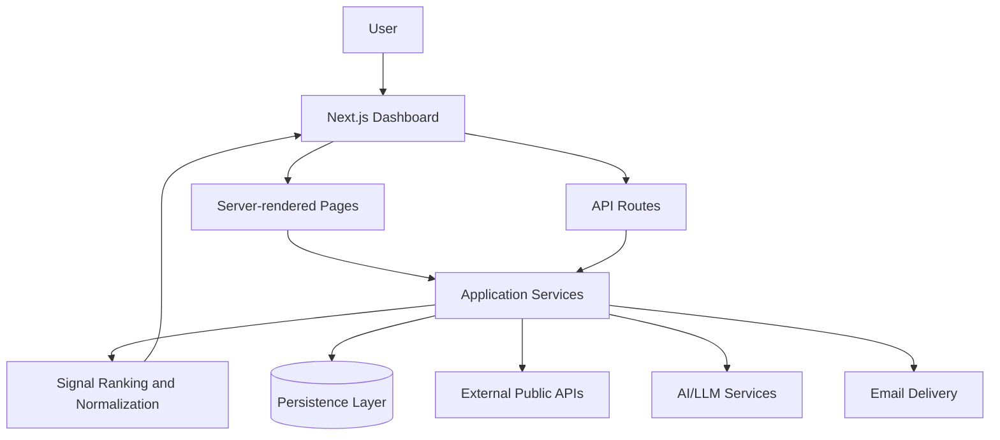

# Research Intelligence Platform

A research intelligence dashboard that turns news, academic papers, developer activity, and AI-assisted analysis into a ranked daily briefing for technical decision-making.

> Public showcase repository. This repo documents the product, architecture, and engineering approach without exposing private source code, credentials, database schema details, proprietary ranking logic, or reusable implementation internals.

## Product Overview

Research Intelligence Platform is a single-user intelligence workspace for tracking emerging technology signals across news, research literature, developer ecosystems, and concept networks. It was built to reduce the daily manual effort of scanning many sources and to convert that fragmented information into structured insight.

The product combines a ranked signal feed, paper analysis workflow, concept explorer, decision scoring workspace, and daily briefing automation. The private implementation includes a Next.js dashboard, server-side aggregation services, optional AI-assisted analysis, and persistence for saved research artifacts.

## Why I Built It

Staying current in fast-moving technical areas requires monitoring too many disconnected sources: academic indexes, security advisories, GitHub activity, Hacker News, public news events, RSS feeds, and individual papers. The challenge is not just collecting links; it is deciding what deserves attention and how a signal connects to a broader research direction.

I built this project to support a complete research loop:

1. Detect meaningful signals.
2. Analyze the underlying paper or source.
3. Connect related technical concepts.
4. Score candidate research directions.
5. Save useful ideas for follow-up.

## Problem It Solves

The platform helps reduce information overload by aggregating high-volume sources into a focused, explainable daily workflow. Instead of manually checking many feeds and losing context across tabs, a user can review ranked signals, inspect supporting evidence, explore concept relationships, and evaluate which ideas are worth pursuing.

## Target Users

- Researchers tracking emerging technical areas.
- Engineers evaluating new tools, papers, or security trends.
- Product or strategy teams monitoring market and developer signals.
- Technical leaders who need concise briefings from noisy public data.

## Core Features

| Feature | Description |
|---|---|
| Daily Signals | Ranked daily feed combining news, research, developer, and repository activity signals. |
| AI Daily Briefing | Concise briefing-style summary of the most important developments. |
| Paper Analysis | PDF/text workflow for extracting structured research insights from papers. |
| Concept Explorer | Interactive concept graph for understanding relationships between signals, papers, and topics. |
| Decision Engine | Weighted scoring workspace for comparing research directions against a specific focus. |
| GitHub Pulse | Developer activity view for repositories and technical ecosystems. |
| Daily Tech Radar Email | Automated digest workflow for sending a daily intelligence snapshot. |
| Source Mode Indicators | Clear distinction between live, cached, fallback, and demo data states. |

## Screenshots

## Feature Walkthrough

### Daily Signals

The dashboard brings together public signals from multiple source categories and presents them as a ranked feed. Each item is normalized into a consistent shape, enriched with metadata, and surfaced with context such as source type, urgency, related concepts, and why the signal may matter.

### Paper Analysis

The paper workflow accepts research paper input, extracts relevant text, applies size and cost controls, and generates a structured analysis. The interface is designed for fast triage: users can understand the paper's contribution, limitations, system implications, and follow-up opportunities without reading the entire document first.

### Concept Explorer

The concept explorer maps relationships between topics, signals, papers, and saved research ideas. It helps users move from isolated headlines to a broader understanding of the technical landscape.

### Decision Engine

The decision workspace scores candidate directions using weighted criteria such as signal strength, concept relevance, research gap, novelty, and evidence quality. It is intended to make research prioritization more explicit and repeatable.

### Daily Tech Radar Email

The automated digest turns the current intelligence snapshot into an email-ready briefing. The workflow includes duplicate-send protection and supports dry-run previews for safer operation.

## Tech Stack

| Layer | Technologies |
|---|---|
| Frontend | Next.js App Router, React, TypeScript, Tailwind CSS |
| Backend/API | Next.js server routes, server components, service-layer orchestration |
| AI/LLM | OpenAI Responses API, structured JSON output, optional embeddings |
| Data Sources | Public news/event feeds, RSS, Hacker News, academic paper APIs, GitHub API |
| Persistence | Local development persistence with planned/optional Postgres support |
| Email | Resend-based delivery workflow |
| Testing | Node.js test runner, focused service-level tests |
| Deployment | Designed for hosted Next.js deployment with scheduled automation support |

## Architecture Overview

The system is organized around server-side data aggregation and feature-specific workspaces. Page requests gather data on the server, normalize external source responses, rank or group candidates, and pass prepared view models to the UI. Interactive workflows, such as paper upload and decision scoring, use API routes backed by service modules.

## Data Flow Overview

1. Public sources are fetched concurrently where appropriate.
2. Source responses are normalized into shared internal view models.
3. Duplicate or low-quality candidates are filtered or deprioritized.
4. Ranking and grouping logic produces a concise daily feed.
5. AI-assisted workflows run only behind explicit routes or actions.
6. Saved analyses, snapshots, and ideas are persisted for later review.
7. The UI communicates source state so users can distinguish live data from fallback or demo content.

## AI, ML, and Automation Components

- Structured paper analysis with schema-constrained model output.
- Optional concept embedding support for semantic relationship boosts.
- Cost controls for model calls, including input limits and request deduplication.
- Deterministic fallback behavior when AI services are unavailable.
- Scheduled daily briefing workflow for email delivery.

## Engineering Highlights

- Server-first architecture that keeps data loading centralized and predictable.
- Source isolation so external API failures degrade gracefully instead of breaking the dashboard.
- Ranking pipeline that considers freshness, credibility, diversity, momentum, and impact.
- Explicit source mode indicators for transparent live/fallback behavior.
- AI workflows designed with schema validation, budget controls, and graceful failure states.
- Modular feature boundaries across signals, papers, concepts, decisions, and email automation.
- Focused automated tests around ranking, concept linking, paper analysis behavior, and send safety.

## Security, Privacy, and IP Notice

This public showcase intentionally excludes:

- Application source code.
- API keys, secrets, tokens, or environment files.
- Private database schemas and production data.
- Client data, user records, saved research artifacts, or logs.
- Proprietary prompts, ranking internals, implementation details, and reusable business logic.

The materials here are for portfolio review only. They describe the product and engineering approach at a high level without providing enough detail to clone or operate the private application.

## What I Learned

- How to design AI-assisted features that remain useful when model access is unavailable.
- How to aggregate unreliable public sources without letting a single failed provider break the product.
- How to make ranking systems more explainable through source metadata and visible state.
- How to build research tooling that connects discovery, analysis, concept mapping, and prioritization.
- How to balance product polish with cost control, privacy, and operational safety.

## Future Improvements

- Multi-user accounts, authentication, and per-user saved workspaces.
- Durable production persistence with richer query support.
- More advanced concept discovery from incoming signal streams.
- Deeper evaluation tools for ranking quality and source credibility.
- Expanded email scheduling and team briefing workflows.
- Observability for source health, latency, and AI usage cost.

## Project Status

Private working project. This repository is a public showcase and documentation artifact only.

