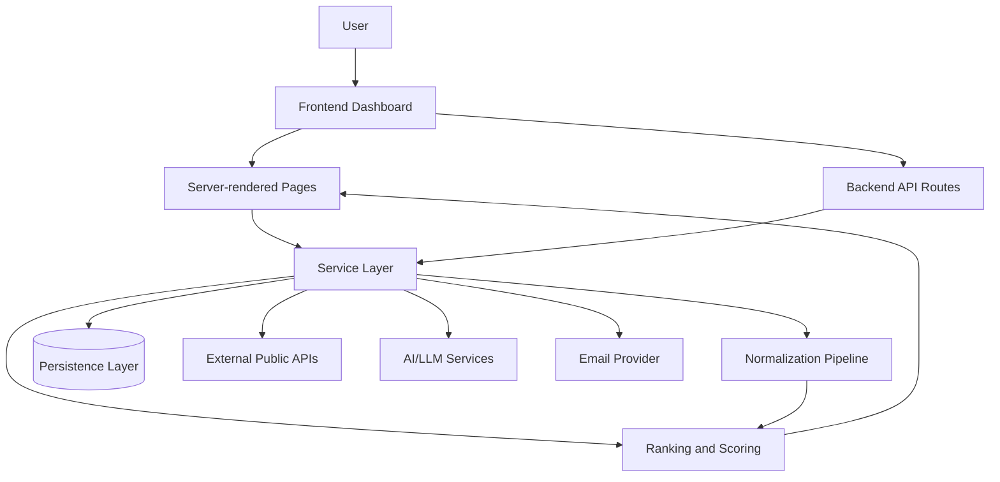
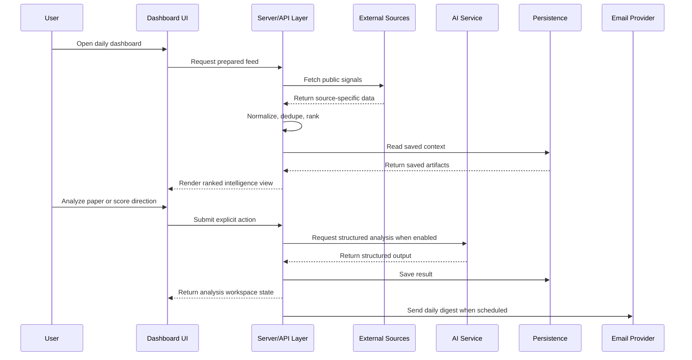

# Architecture

This document describes the public architecture of Research Intelligence Platform at a high level. It intentionally avoids private source code, exact database structure, secrets, proprietary prompts, and implementation details that would make the private application easy to clone.

## System Overview

Research Intelligence Platform is organized as a server-rendered dashboard with feature-specific workspaces. The application aggregates public sources, normalizes signals, ranks important items, supports AI-assisted paper analysis, maps concept relationships, and prepares daily intelligence snapshots.

## Frontend Layer

The frontend is built as a dashboard-style interface with focused workspaces:

- Daily intelligence feed.
- Research paper discovery and analysis.
- Concept graph exploration.
- Decision scoring workspace.
- Email briefing preview/status surfaces.

The UI emphasizes scannability: compact cards, source metadata, status indicators, and direct paths between related features. Client-side interactivity is used where it improves the workflow, such as file upload, graph interaction, saved items, and decision scoring controls.

## Backend/API Layer

The backend is responsible for orchestration rather than just raw data pass-through. Key responsibilities include:

- Fetching source data.
- Handling provider failures.
- Normalizing heterogeneous responses.
- Ranking and grouping daily signals.
- Running AI-assisted workflows behind explicit actions.
- Saving analysis outputs and snapshots.
- Preparing email-ready digest data.

API routes are treated as thin entry points into application services. This keeps business logic easier to test and avoids scattering provider-specific behavior across the UI.

## Data Layer

The private project supports local development persistence and is designed with a path toward production database persistence. Public documentation does not include the exact schema.

Persisted artifact categories include:

- Saved paper analyses.
- Research workspace outputs.
- Saved ideas or concepts.
- Daily intelligence snapshots.
- Email delivery records.

The data model is intentionally separated from the public source integrations so saved research artifacts can remain private.

## External APIs

The platform integrates with public or optional external source categories, including:

- News and event feeds.
- RSS feeds from trusted sources.
- Hacker News or developer attention sources.
- Academic paper metadata providers.
- GitHub repository activity.

External calls are isolated so one unavailable provider does not break the whole dashboard. Source status is surfaced to the user where relevant.

## AI/LLM Services

AI is used as an assistive layer for structured analysis and briefing workflows. The private implementation includes safeguards around:

- Input size limits.
- Structured response expectations.
- Output validation before persistence.
- Duplicate request suppression.
- Graceful degradation when AI services are unavailable.

The concept graph can optionally use semantic assistance, but the public showcase omits proprietary prompts and implementation details.

## Authentication and Security

The current private project is primarily a personal research tool. Public showcase materials avoid publishing any credentials, private environment files, user data, saved research outputs, or operational secrets.

Security-conscious design considerations include:

- Secrets supplied through environment configuration, never hard-coded.
- AI and email automation endpoints protected by server-side checks.
- File analysis workflows constrained by size and processing limits.
- Public documentation limited to product and architectural concepts.
- Clear separation between showcase assets and private application code.

## Deployment Assumptions

The application is designed for a hosted web deployment that can support:

- Server-rendered dashboard pages.
- API routes for interactive workflows.
- Environment-based configuration.
- Optional scheduled jobs for daily email automation.
- Durable persistence for production use.

The exact production setup is private and intentionally not documented in this showcase.

## High-Level Data Flow

## Reliability Strategy

- Each source category is allowed to fail independently.
- The feed can still render using available, cached, fallback, or demo data.
- Source state is shown in the UI so users understand data freshness.
- Expensive operations are bounded by explicit limits.
- AI failures are handled as user-visible states rather than generic crashes.

## Privacy Boundaries

This showcase does not expose:

- Source code.
- Private database details.
- API keys or environment values.
- Production logs.
- Proprietary ranking formulas.
- Proprietary prompts.
- Client or user data.

